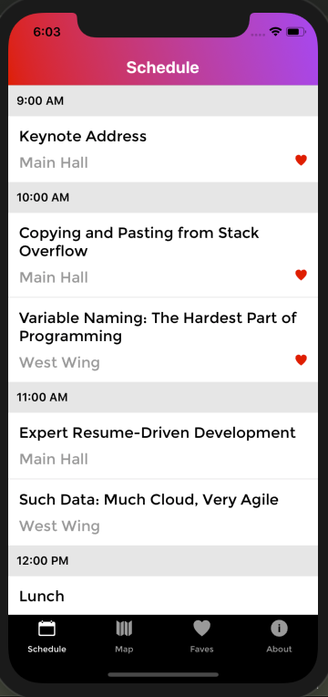
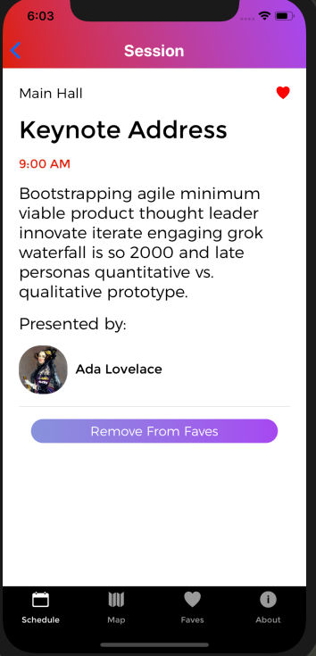

# R10

R10 is a mobile application that allows user to check out speakers sessions happening at the R10 Conference. The user can like, unlike sessions, and read up more info on the sessions. The sessions that are liked will be featured in a favorite list. The app can be viewed on both iOS and Android devices.

## Author

- Tim Nguyen | https://github.com/timng93

## Screenshots

### Schedule Screen

### Session Screen

## Technologies Used

`Back-end Development`:

- Async Storage
- GraphQL
- Apollo
- Node.js

`Front-end Development`:

- React Native

## Installation Instructions

Install
`npm install`

Run App on iOS simulator
`react-native run-ios`
XCode is required as iOS Simulator

Run App on Android simulator
`react-native run-android`
Android Studio is required as Android Simulator

## Reflections

The project was informative for me to learn how React Native works. It was quite interesting to build the app on both platform iOS and Android devices. There were things specific to each platform, which I would then built them differently. 
